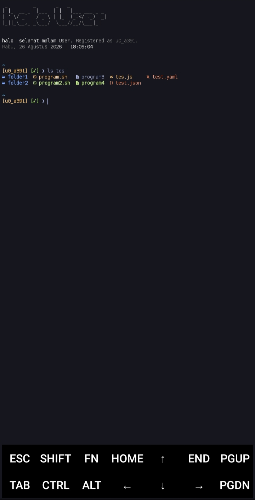
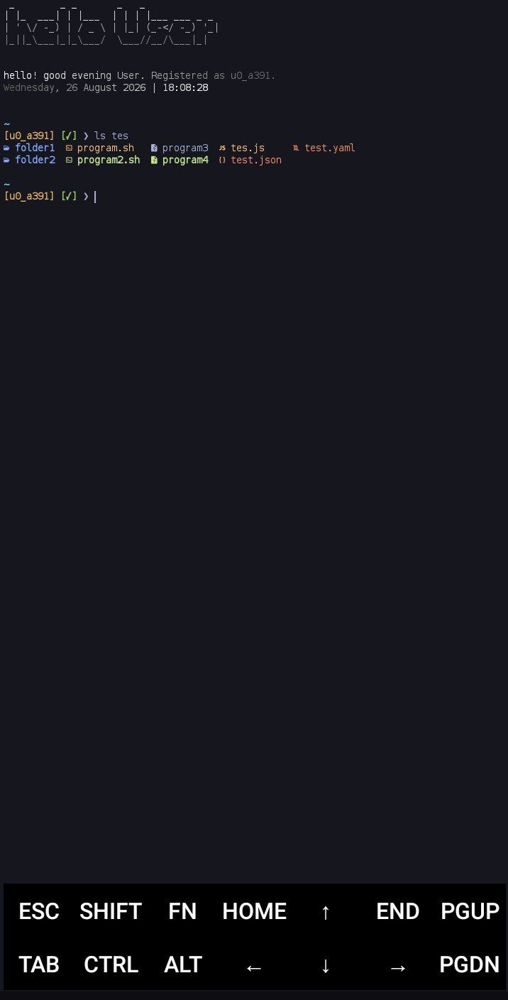

# Tes.


---

## 🇮🇩 Buatan Indonesia

Skrip konfigurasi dan kustomisasi lingkungan Termux yang elegan, cepat, dan kaya fitur. Dibuat oleh anak bangsa Indonesia. (kece bet gwej 🗿)

### 🌟 Fitur Utama
- ⚡ **Ringan & Cepat:** Optimasi startup terminal menggunakan sistem caching cerdas (`vivid` & `starship`).
- 🔄 **Multibahasa:** Mendukung skrip instalasi interaktif dalam Bahasa Indonesia (`id`) dan English (`en`).
- 🎨 **Enhanced LS & Prompt:** Menggunakan `eza` dengan ikon & git status, serta prompt modern dari `Starship`.
- ✨ **Startup Spinner:** Animasi pemuatan interaktif yang mulus saat membuka sesi terminal baru.
- 🛠️ **Mudah Disetup:** Proses instalasi otomatis termasuk konfigurasi font dan skema warna terminal.

### 🚀 Cara Instalasi & Penggunaan

Jalankan perintah berikut:

```bash
# Install paket (kalau ada pertanyaan di bagian upgrade, maka pencet enter saja)
pkg update && pkg upgrade -y
pkg install git -y

# 1. Clone repositori
git clone https://github.com/pikri69/tes.git
cd tes

# 2. Beri akses ke install.sh
chmod +x install.sh

# 3. Jalankan instalasi (pilih 'id' untuk Bahasa Indonesia atau 'en' untuk English)
./install.sh id
# atau
./install.sh en
```

Untuk menghapus konfigurasi dan mengembalikan pengaturan awal:
```bash
./uninstall.sh
```

### ⚙️ Setup Nama dan Zona Waktu

Jika kamu ingin mengubah nama *User* dan zona waktunya,
maka editlah file `sapa.sh` yang ada di direktori .rc kamu (`~/.rc/`).

Cari barisan `nama` dan ubah isi variabelnya menjadi nama kamu.
Untuk zona waktu, cari barisan `zona_waktu` dan ubah variabelnya menjadi zona waktu kamu.
*Contoh:* `zona_waktu="Asia/Jakarta"`

---

## 🇬🇧 English

An elegant, fast, and feature-rich Termux environment configuration and customization script. Made by an Indonesian.

### 🌟 Key Features
- ⚡ **Lightweight & Fast:** Terminal startup optimization using smart caching (`vivid` & `starship`).
- 🔄 **Multilingual:** Supports interactive installation scripts in Indonesian (`id`) and English (`en`).
- 🎨 **Enhanced LS & Prompt:** Powered by `eza` with icons & git status, alongside modern `Starship` prompt.
- ✨ **Startup Spinner:** Smooth interactive loading animation when opening a new terminal session.
- 🛠️ **Easy Setup:** Fully automated installation process including terminal font and color scheme configuration.

### 🚀 Installation & Usage

Run the following command:

```bash
# Install packages (if there are questions in the upgrade section, just press enter)
pkg update && pkg upgrade -y
pkg install git -y

# 1. Clone the repository
git clone https://github.com/pikri69/tes.git
cd tes

# 2. Give access to install.sh
chmod +x install.sh

# 3. Run installation (choose 'en' for English or 'id' for Indonesian)
./install.sh en
# or
./install.sh id
```

To remove the configuration and restore default settings:
```bash
./uninstall.sh
```

### ⚙️ Name and Timezone Setup

If you want to change your *User* name and timezone, edit the `greet.sh` file located in your `.rc` directory (`~/.rc/`).

Look for the `name` line and change the variable value to your name.
For timezone, look for the `timezone` line and change its value to your timezone.
*Example:* `timezone="Asia/Jakarta"`

---

## 📸 Preview




## License

License: MIT

---
<p align="center">Made with ❤️ by <a href="https://github.com/pikri69">pikri69</a></p>
